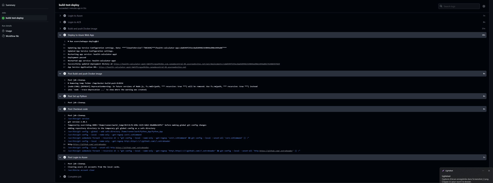
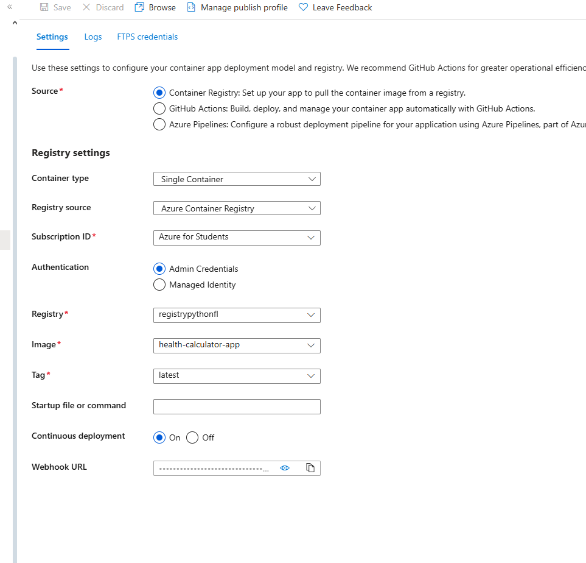
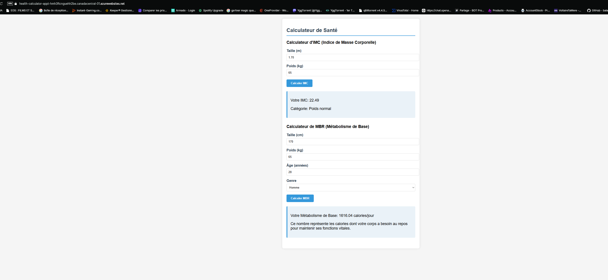

# Health Calculator Microservice

Une application microservice basée sur Flask qui fournit des API pour calculer des métriques de santé (IMC et MBR) avec une interface web conviviale. Ce projet inclut une configuration complète DevOps avec Docker, Makefile et un pipeline CI/CD pour le déploiement sur Azure.

## Fonctionnalités

- **Calcul d'IMC (Indice de Masse Corporelle)**
  - Calcule l'IMC à partir du poids (kg) et de la taille (m)
  - Fournit une classification basée sur le résultat (insuffisance pondérale, poids normal, surpoids, obésité)

- **Calcul de MBR (Métabolisme de Base)**
  - Utilise l'équation de Harris-Benedict pour calculer le métabolisme de base
  - Prend en compte la taille, le poids, l'âge et le genre

- **API REST**
  - Endpoint `/bmi` pour le calcul de l'IMC
  - Endpoint `/bmr` pour le calcul du MBR

- **Interface Web**
  - Interface utilisateur intuitive pour effectuer les calculs
  - Visualisation des résultats avec explications

- **Intégration CI/CD**
  - Pipeline automatisé pour tester, construire et déployer l'application
  - Utilisation d'un registre de conteneurs Azure (ACR)
  - Déploiement sur Azure App Service

## Structure du Projet

```
HEALTH-CALCULATOR-SERVICE/
├── app.py                  # Application Flask principale
├── health_utils.py         # Fonctions de calcul des métriques de santé
├── test.py                 # Tests unitaires
├── requirements.txt        # Dépendances Python
├── Makefile                # Automatisation des commandes
├── Dockerfile              # Configuration Docker
├── templates/              # Templates HTML
│   └── home.html           # Interface utilisateur
├── .github/                # Configuration GitHub Actions
│   └── workflows/
│       └── ci-cd.yml       # Pipeline CI/CD
```

## Équations Utilisées

### IMC (Indice de Masse Corporelle)
```
IMC = poids (kg) / (taille (m))²
```

### MBR (Métabolisme de Base) - Équation de Harris-Benedict
Pour les hommes:
```
MBR = 88.362 + (13.397 × poids (kg)) + (4.799 × taille (cm)) - (5.677 × âge (années))
```

Pour les femmes:
```
MBR = 447.593 + (9.247 × poids (kg)) + (3.098 × taille (cm)) - (4.330 × âge (années))
```

## Prérequis

- Python 3.9 ou supérieur
- Docker (pour la conteneurisation)
- Make (pour l'utilisation du Makefile)
- Compte Azure avec crédits disponibles
- Git et GitHub

## Installation et Exécution Locale

1. **Cloner le dépôt**
   ```bash
   git clone https://github.com/Thildown/Python_App.git
   cd health-calculator-service
   ```

2. **Créer un environnement virtuel**
   ```bash
   python -m venv venv
   ```

3. **Activer l'environnement virtuel**
   - Sur Windows:
     ```bash
     venv\Scripts\activate
     ```
   - Sur macOS/Linux:
     ```bash
     source venv/bin/activate
     ```

4. **Installer les dépendances**
   ```bash
   make init
   ```
   ou
   ```bash
   pip install -r requirements.txt
   ```

5. **Exécuter les tests**
   ```bash
   make test
   ```

6. **Lancer l'application**
   ```bash
   make run
   ```

7. **Accéder à l'application**
   Ouvrez votre navigateur et accédez à `http://localhost:5001`

## Utilisation de Docker

1. **Construire l'image Docker**
   ```bash
   make build
   ```
   ou
   ```bash
   docker build -t health-calculator-service:latest .
   ```

2. **Exécuter le conteneur**
   ```bash
   docker run -p 5001:5000 health-calculator-service:latest
   ```

3. **Accéder à l'application**
   Ouvrez votre navigateur et accédez à `http://localhost:5001`

## API Endpoints

### Calculer l'IMC
**Endpoint**: `/bmi`  
**Méthode**: POST  
**Payload**:
```json
{
  "height": 1.75,  // Taille en mètres
  "weight": 70     // Poids en kilogrammes
}
```
**Réponse**:
```json
{
  "bmi": 22.86,
  "category": "Poids normal"
}
```

### Calculer le MBR
**Endpoint**: `/bmr`  
**Méthode**: POST  
**Payload**:
```json
{
  "height": 175,    // Taille en centimètres
  "weight": 70,     // Poids en kilogrammes
  "age": 30,        // Âge en années
  "gender": "male"  // "male" ou "female"
}
```
**Réponse**:
```json
{
  "bmr": 1695.67
}
```

## Configuration du Déploiement sur Azure

### Prérequis Azure

1. **Créer un groupe de ressources Azure** (si vous n'en avez pas déjà un)
   ```bash
   az group create --name votre-groupe-ressources --location westeurope
   ```

2. **Créer un registre de conteneurs Azure (ACR)**
   ```bash
   az acr create --resource-group votre-groupe-ressources --name votreregistreacr --sku Basic
   ```

3. **Activer l'accès administrateur pour ACR**
   ```bash
   az acr update -n votreregistreacr --admin-enabled true
   ```

4. **Récupérer les informations d'identification ACR**
   ```bash
   az acr credential show --name votreregistreacr
   ```

5. **Créer une App Service Azure**
   ```bash
   az appservice plan create --name health-calculator-plan --resource-group votre-groupe-ressources --sku B1 --is-linux
   az webapp create --resource-group votre-groupe-ressources --plan health-calculator-plan --name health-calculator-app --deployment-container-image-name mcr.microsoft.com/appsvc/staticsite:latest
   ```

6. **Configurer l'App Service pour utiliser votre ACR**
   ```bash
   az webapp config container set --name health-calculator-app --resource-group votre-groupe-ressources --docker-custom-image-name votreregistreacr.azurecr.io/health-calculator-app:latest --docker-registry-server-url https://votreregistreacr.azurecr.io --docker-registry-server-user votreregistreacr --docker-registry-server-password <mot_de_passe>
   ```

7. **Activer le déploiement continu**
   ```bash
   az webapp config container set --name health-calculator-app --resource-group votre-groupe-ressources --enable-cd true
   ```

### Configuration des Secrets GitHub

Pour que le pipeline CI/CD fonctionne correctement, vous devez configurer les secrets suivants dans votre dépôt GitHub:

1. **AZURE_CREDENTIALS**: Créez un principal de service Azure (service principal)
   ```bash
   az ad sp create-for-rbac --name "health-calculator-app" --role contributor --scopes /subscriptions/{votre-subscription-id}/resourceGroups/{votre-groupe-ressources} --sdk-auth
   ```
   Copiez la sortie JSON complète comme valeur du secret.

2. **ACR_LOGIN_SERVER**: URL de votre registre ACR (exemple: `votreregistreacr.azurecr.io`)

3. **ACR_USERNAME**: Nom d'utilisateur de votre ACR (généralement le nom du registre)

4. **ACR_PASSWORD**: Mot de passe de votre ACR (obtenu via la commande `az acr credential show`)

### Comment ajouter les secrets GitHub

1. Allez à votre dépôt GitHub.
2. Cliquez sur "Settings" > "Secrets and variables" > "Actions".
3. Cliquez sur "New repository secret" pour chaque secret à ajouter.

## Pipeline CI/CD

Le pipeline CI/CD, défini dans `.github/workflows/ci-cd.yml`, effectue les opérations suivantes:

1. **Checkout**: Récupère le code du dépôt.
2. **Setup Python**: Configure l'environnement Python.
3. **Installation des dépendances**: Installe les packages nécessaires.
4. **Tests**: Exécute les tests unitaires.
5. **Login Azure**: S'authentifie auprès d'Azure.
6. **Login ACR**: S'authentifie auprès du registre de conteneurs Azure.
7. **Build et Push**: Construit l'image Docker et la pousse vers ACR avec deux tags:
   - Un tag spécifique basé sur le SHA du commit
   - Le tag `latest`
8. **Déploiement**: Déploie l'image sur Azure App Service.


L'utilisation du tag `latest` permet de simplifier le déploiement, car l'App Service est configurée pour toujours utiliser la dernière version de l'image sans nécessiter de mise à jour manuelle.

## Commandes du Makefile

- `make init`: Installe les dépendances du projet
- `make run`: Démarre l'application Flask
- `make test`: Exécute les tests unitaires
- `make build`: Construit l'image Docker
- `make clean`: Nettoie les fichiers temporaires

## Résultats du Déploiement

Le déploiement a été réalisé avec succès sur Azure App Service. Voici les étapes du déploiement et les résultats:

1. **Pipeline CI/CD**: Le workflow GitHub Actions a exécuté toutes les étapes sans erreur, y compris les tests, la construction de l'image Docker et le déploiement sur Azure.


2. **Registre de Conteneurs Azure**: L'image Docker a été correctement poussée vers ACR avec les deux tags.


3. **App Service**: L'application a été déployée avec succès et était accessible via l'URL Azure App Service.



4. **Tests Fonctionnels**: Les endpoints API `/bmi` et `/bmr` ont été testés et fonctionnaient correctement.

*Note: Toutes les ressources Azure ont été supprimées après les tests pour préserver les crédits Azure pour d'autres projets d'études.*

## Dockerfile Optimisé

Le Dockerfile utilisé est optimisé pour l'environnement Azure App Service:

```Dockerfile
FROM python:3.9-slim

WORKDIR /app

COPY requirements.txt .
RUN pip install --no-cache-dir -r requirements.txt

COPY . .

# Expose le port 5001
EXPOSE 5001

# Variable d'environnement pour Flask
ENV FLASK_APP=app.py
ENV PORT=5001

# Commande de démarrage avec gunicorn pour la production
CMD gunicorn --bind 0.0.0.0:5001 app:app
```

